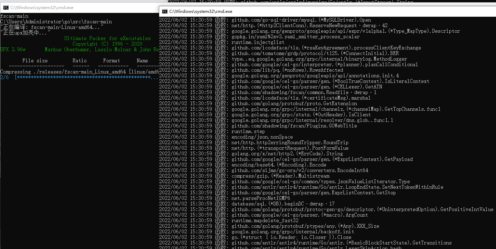

# go-build-tools

主要是每次都要重新编译。
这次做了4个编译版本
1. 正常编译
2. 正常编译+upx编译
3. 正常编译+去除信息编译
4. 正常编译+去除信息编译+upx编译

支持win和Linux
mac的话对linux脚本改改就能用

我们编译了8个版本
```
Linux Amd+Amd64
Linux Arm+Arm64
Win Win64+Win32
Mac Intel+Amd64
Mac M1+Arm64
```
我们只要把这几个脚本放到项目目录就可以了，他会自动获取当前目录名字然后编译到当前目录的Releases文件夹

References
```
https://github.com/upx/upx
https://github.com/boy-hack/go-strip
```
